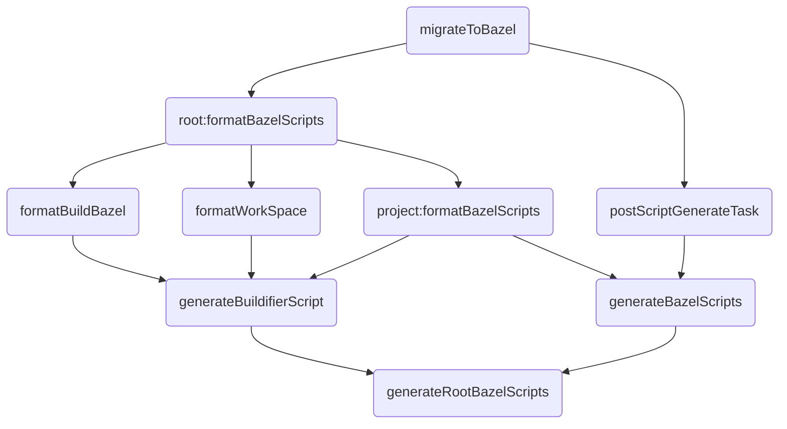

```mermaid
flowchart TD
  A(generateBazelScripts)
  B(generateRootBazelScripts)
  C(root:formatBazelScripts)
  D(formatBuildBazel)
  E(formatWorkSpace)
  F(project:formatBazelScripts)
  G(postScriptGenerateTask)
  H(migrateToBazel)
  I(generateBuildifierScript)

  H --> C
  H --> G

  C --> D
  C --> E
  C --> F

  G --> A

  D --> I

  E --> I

  F --> I
  F --> A
  
  A --> B

  I --> B
```
